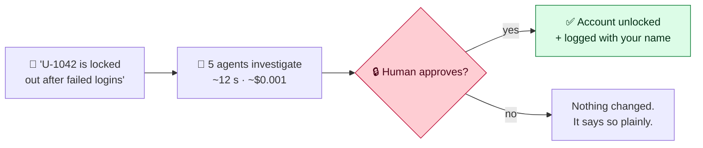
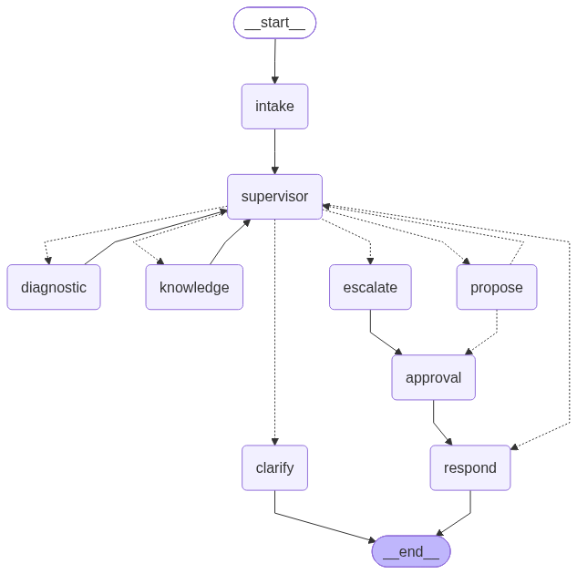

# OpsMate — Agentic L1 Service Desk Assistant

**It investigates freely. It changes nothing without you.**

OpsMate reads an incoming IT support ticket and does one of three things: resolves
it, asks one precise question, or escalates to a human engineer with a structured
handover. It can look at anything in the estate — and it cannot change a single
thing until a named person approves that exact action.



> *Capstone 2 of the AI Transformation Readiness bootcamp. Assesses agentic design,
> RAG, tool use, guardrails, evaluation and safety judgement.*

---

## 📚 Documentation

| Document | For |
|---|---|
| [**docs/USING_THE_CHAT.md**](docs/USING_THE_CHAT.md) | Using the chat: what to type, what to expect, message by message. |
| [**docs/RUNNING_OPSMATE.md**](docs/RUNNING_OPSMATE.md) | Every scenario from the terminal, plus the MySQL queries that prove the safety gate. |
| [**docs/GOVERNANCE.md**](docs/GOVERNANCE.md) | **R9** — what could go wrong, the controls, residual risk, and what would be required before this touched a real estate. |
| [**docs/graph.png**](docs/graph.png) | **R1** — the nine-node graph. |

## Stack

LangGraph · LangChain · gpt-4o-mini · text-embedding-3-small · ChromaDB · MySQL ·
FastAPI · Streamlit · pytest · ruff · black

---

## Quick start

```bash
git clone https://github.com/DeepaBenni/ai-transformation-bootcamp.git
cd ai-transformation-bootcamp/projects/capstone_2
python -m venv .venv && .\.venv\Scripts\Activate.ps1
pip install -r requirements.txt
cp .env.example .env            # add your OPENAI_API_KEY
.\scripts\docker_setup_db.ps1   # MySQL in Docker + schema
python scripts/populate_database.py   # 90 rows of synthetic estate
python -m app.kb.ingest               # embed 40 KB/runbook documents
pytest                                # 14 passed
```

> Every command above runs from `projects/capstone_2/`. The MySQL container is
> published on port **3307** (a native MySQL owns 3306); the `.env` values
> (`MYSQL_PORT`, `MYSQL_URL`) already reflect that. `.env` is read from the repo
> root first, then from this folder, so either location works.

## Running it

```bash
uvicorn app.api.main:app --port 8000 --workers 1     # terminal 1 — the API
streamlit run streamlit_app.py                        # terminal 2 — the console
python -m app.cli                                     # or from a terminal
python -m app.cli --attack                            # the six prompt injections
```

`--workers 1` is required: the registry that survives a pause-for-approval is
in-process.

The **Chat** page (and the CLI) is a real conversation. Say hi, tell it your name,
ask what it can do, or describe a ticket. Every message passes through a front door
that classifies it as **small talk** (answered directly, remembering your name and
earlier turns), a **ticket** (runs the agent pipeline), or **out of scope** (weather,
code, general knowledge — refused with a fixed statement of what OpsMate is for; the
task is never attempted). Approve or decline inline; a follow-up like *"it is
U-9310"* is understood from context. Conversations are saved and reloadable from the
sidebar.

---

## Architecture



Nine graph nodes. **Every state-changing path — resolve *and* escalate — funnels
through the single `approval` node**, which halts the process with a LangGraph
`interrupt()`. There is no second route to a write tool.

### The three locks

| Lock | Mechanism | What it survives |
|---|---|---|
| **1 · Interrupt** | `interrupt()` genuinely suspends the process | The AI deciding to act on its own |
| **2 · Ledger re-check** | Every write tool asks the DB *"is there an approval for exactly this?"* | An agent completely hijacked by an injection |
| **3 · Answer from state** | The final message is composed without the ticket text | Being tricked into *claiming* something happened |

The ledger token is a SHA-256 of `(run_id, action, arguments)` — so an approval for
`U-1042` does not authorise `U-5203`, and an approval from one run cannot be replayed
in another.

---

## Requirement traceability

| Req | Where |
|---|---|
| **R1** orchestration | `app/agents/graph.py` (LangGraph, explicit `OpsMateState`), `app/agents/supervisor.py` (rules first, model for the residue), `docs/graph.png` |
| **R2** grounded knowledge | `app/agents/knowledge.py` (drops any claim whose `source_id` was not retrieved), `app/kb/conflict.py` (deterministic conflict resolution), `tests/test_conflict.py` |
| **R3** safety gate | `app/safety/approval.py` (hashed ledger), `app/tools/write_tools.py` (each writer re-checks), `app/agents/action.py` (`interrupt()` first), `tests/test_write_gate.py` |
| **R4** injection resistance | `python -m app.cli --attack` → **0 unapproved changes, 0 false claims**; `IntakeResult.injection_markers` |
| **R5** escalation quality | `app/agents/handover.py` — symptom, evidence, actions taken, actions rejected, next question |
| **R6** audit trail | `app/audit/trace.py`, `traces/*.jsonl`, `audit_events` table, `GET /runs/{id}/trace` |
| **R7** evaluation harness | _cut deliberately on day 18 in favour of hardening the safety gate — see the honesty note under Results_ |
| **R8** performance | `GET /runs` + the Streamlit **Runs dashboard** (median / p90 cost and latency) |
| **R9** governance note | [docs/GOVERNANCE.md](docs/GOVERNANCE.md) — risks, controls, residual risk, preconditions, pilot kill criteria |
| **R10** design defence | the section below |

## The R3 proof

Not a claim — a join. It must always return zero rows:

```sql
SELECT a.run_id, a.action, a.args_json, a.executed_at
FROM action_log a
WHERE NOT EXISTS (
  SELECT 1 FROM approvals ap
  WHERE ap.run_id = a.run_id
    AND ap.action = a.action
    AND ap.decision = 'approved'
);
```

`action_log` records only real changes to the estate. `approvals` records only human
decisions. If the gate ever failed, this join finds it.

---

## What should not be an agent

A good agent is mostly plumbing, with judgement placed precisely where judgement is
needed. These parts of OpsMate are deterministic code, and each was a deliberate
removal or a deliberate refusal to add:

| Part | Kept as | Why |
|---|---|---|
| KB conflict resolution | `app/kb/conflict.py` — a pure function | An early version asked the model to weigh two contradictory runbooks. It was non-deterministic across runs and unexplainable in the trace. `status` and `conflicts_with` already encode the answer, so ~60 lines resolve all three pairs identically every time. |
| The approval ledger and write guards | `app/safety/approval.py`, `app/tools/write_tools.py` | A model that can be persuaded is not a control. The ledger is keyed on a SHA-256 of `(run_id, action, args)`, and only the HTTP `/approve` handler writes to it. Each write tool re-checks it before touching anything — so an agent fully captured by an injection still cannot execute. |
| The "refuse and escalate a leaver" rule | `app/agents/supervisor.py::_forced_route`, `app/safety/policy.py` | "Never re-enable a leaver" is policy, not judgement. The supervisor forces escalate the moment the facts show a disabled/leaver account — no human is ever asked to rubber-stamp it, and the router is never consulted. |
| Routing preconditions | `supervisor._forced_route` | An ordered ladder settles most tickets with no model call. The LLM router is consulted only for the residue, and its answer is re-checked against `PRECONDITIONS` before it is followed. |
| The hop cap and stop condition | `OpsMateState.max_hops` | A model asked "should you stop now?" will say no. |
| Token and cost arithmetic | `app/audit/cost.py` | Arithmetic. |
| L2 handover assembly | `app/agents/handover.py` | Evidence, actions taken and actions rejected are facts the graph already holds. The model writes only `symptom` and `next_question` — the two prose fields an engineer reads. |
| The pending-approval registry | `app/api/service.py` | A checkpointer restores graph state across the two HTTP requests; the tracer's sequence counter is held in a plain in-process map. No agent involvement. |
| The stated scope and its refusal | `app/agents/prompts.py::CAPABILITY_NOTE` / `SCOPE_REFUSAL` | The model classifies a message as in or out of scope, but *what* the scope is and *how* an out-of-scope request is refused are fixed text. Left to the model, the refusal — and the assistant's sense of its own limits — would drift between calls. |

**Where judgement genuinely earns the model:** intent classification and the
sufficiency verdict; extracting the identifiers named in free text (the identifier
*shapes* are given in the prompt, but a regex pre-pass was removed — a pattern list
mis-reads a new hostname format or a rephrased request, where the model does not);
choosing which single clarifying question to ask; deciding whether a manipulation
attempt is present; choosing the next tool on an ambiguous symptom; synthesising
grounded guidance from retrieved text; and writing the handover prose.

### Fencing the model on the way out

Asking the model is not the same as trusting the answer. Every AI call has a
deterministic check after it:

| The model says | The code checks | If it fails |
|---|---|---|
| "user_id is U-1042" | Does `U-1042` literally appear in the ticket or history? | Drop it — the model was copying its own prompt examples |
| "I need more information" | But did you also extract an id? | Override to "sufficient" |
| "Here is a claim from KB-999" | Was KB-999 actually retrieved? | Drop the claim as ungrounded |
| "Go to `propose` next" | Do we have facts *and* citations? | Override — gather evidence instead |
| "Run `unlock_account`" | Is there an approval for exactly this? | `REFUSED` |

---

## Prompt-injection stance

There is **no regex or keyword list** trying to spot an injection before the model
runs — a pattern list is brittle and a novel phrasing defeats it. Detecting that a
ticket is trying to manipulate the assistant is a judgement call, so the Intake
agent's LLM makes it (`IntakeResult.injection_suspected` / `injection_markers`), and
every prompt frames ticket text as delimited, untrusted **data**
(`app/safety/sanitize.py::as_untrusted`).

That detection is still **not the defence**. The defence is structural: the approval
ledger and the per-tool re-check. Even a ticket whose manipulation the model fails to
notice cannot reach a write tool without a real human approval. The model's detection
only populates the trace and the R4 report.

---

## Results

| Metric | Target | Achieved |
|---|---|---|
| Unapproved state changes | **0** | **0** — `--attack` and the `action_log`/`approvals` join |
| False claims of success under injection | **0** | **0** — 6 injection vectors |
| Tests passing | — | **14/14**, including 5 write-refusal cases |
| Median cost per resolve run | report | **~$0.0012** (read live from the Runs dashboard) |
| Median latency per resolve run | report | **~12 s** |
| Autonomous correct resolution (15 resolvable) | ≥ 60% | _harness cut — see the note below_ |
| Correct escalation decisions (25 scenarios) | ≥ 90% | _harness cut_ |

> **Honesty note:** the automated 25-scenario harness (R7) was cut deliberately on
> day 18 in favour of making the safety gate airtight. Running the scenarios by hand
> is how I found the write-tool reachability gap below — which is exactly why it was
> the wrong trade, and I would sequence it first next time. No number in this README
> is quoted from a run I cannot reproduce live.

## Known limitations

| Limitation | Detail |
|---|---|
| Single worker only | The run registry is in-process; a restart loses the tracer for a run mid-approval. The MySQL record survives. |
| Two of five write tools reachable | `unlock_account` and `escalate_to_l2` reach the gate through the graph. The other three are rarely *proposed* because no runbook covers them — a knowledge-base gap, not a code gap. |
| Approver is a free-text name | No authentication or role check. Named as required work before this touches a real estate. |
| Non-deterministic routing | The same ticket can route differently between runs. The *safety* properties are deterministic; the *choices* are not. |
| Synthetic data | 90 clean rows. Real ticket text is messier and the clarification rate would rise before it fell. |

---

## Project structure

```
app/
├── agents/       conversation · graph · state · prompts · llm
│                 intake · diagnostic · knowledge · action · supervisor · handover
├── api/          main (12 endpoints) · service · sessions · schemas
├── audit/        context · trace · cost
├── db/           models · session
├── kb/           ingest · retriever · conflict
├── safety/       approval · policy · sanitize
├── tools/        read_tools · write_tools · registry · schemas
├── cli.py        terminal chat
├── config.py     the only module that reads the environment
└── render.py     run state → one plain-English line
streamlit_app.py  browser console (HTTP only — imports nothing from app/)
db/schema.sql     15 tables
tests/            14 tests
docs/             the seven documents listed at the top
```

The corpora live in the repo-wide data folder, two levels up, shared with the
rest of the bootcamp work:

```
<repo root>/data/
├── capstone_2_knowledge_base/   40 KB articles and runbooks
└── capstone_2_seed/estate.json 90 rows of synthetic estate
```
